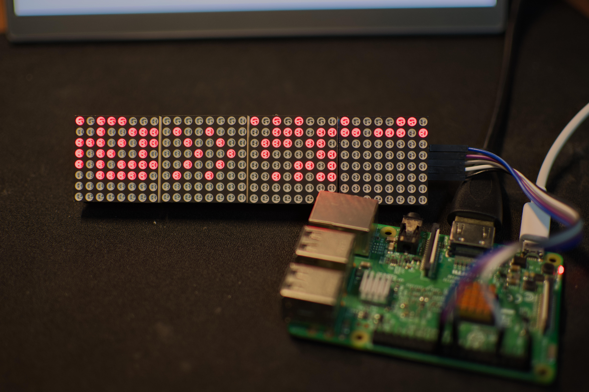

# Retro Ethernet Sniffer



A wifi sniffer. Find out who is talking in your Wifi(ethernet), display their MAC addresses in a binary form on a LED Matrix. **Retro style!**

## Hardware

### What you should prepare

- Raspberry Pi (for me it's a 3B, so anything later than 3B should probably work)

- LED matrix driven by MAX7219. You should buy at least 4 8*8 matrix modules. I bought a module contains 4 matrices on a single board for CNY 17.6

- level shifter(optional. Developers of luma.led_matrix recommend adding this between your raspberry pi GPIO and LED module for a good reason. I did't use this but it works without problem.)

- wire, power supply, etc.

### Wiring

| Board Pin | Name | Remarks     | RPi Pin | RPi Function     |
|-----------|------|-------------|---------|------------------|
| 1         | VCC  | +5 Power    | 2       | 5V0              |
| 2         | GND  | Ground      | 6       | GND              |
| 3         | DIN  | Data In     | 19      | GPIO 10(MOSI)    |
| 4         | CS   | Chip Select | 24      | GPIO 8(SPI CE0)  |
| 5         | CLK  | Clock       | 23      | GPIO 11(SPI CLK) |

I copied this table from [luma.led_matrix documentation](https://luma-led-matrix.readthedocs.io/en/latest/install.html#max7219-devices-spi). It works for me.

## Software

After configure all the hardware stuff mentioned in /Hardware/README.md, it's time to actually run this lovely toy!

To run this script, you should first install Python3 and pip in your Raspberry Pi(for me it's a Pi 3B).

```bash
sudo apt update
sudo apt install python3 python3-pip
```

Then install scapy and luma.led_matrix. You can install them from pip.

```bash
# You can use either this
pip install -r requirements.txt
# or this
sudo pip install luma.led-matrix
sudo pip install scapy
# I personally love the first one most.
```

After installation of python related stuff, you should turn on SPI interface in raspi-config by this command:

```bash
sudo raspi-config
```

In the Interface sub manuel, you should find SPI. Turn it on, then reboot. You can probably do this step in GUI, but I love when someone write a useable TUI.

After all this, you can probably run this script by this command:

```bash
sudo python3 ./main.py
```

Enjoy! (If it works :)
